# Parqueadero-NetCore-ArchCLEAN-DAPPER

# Componente teorico

## Con  tus  propias  palabras  define  el  concepto  de  Clase,  interfaz,  método  y objeto. Siéntete libre de utilizar ejemplos cotidianos y por qué no, fragmentos de código en el lenguaje que prefieras.

- Clase : Abstracion de un elemento de nuestra realidad, permite representar elementos de nuestro entorno para la resolucion de problemas por medio de la programacion oriendad a objetos.

```csharp
public class Persona{
    public string Nombres {get; set;}
    public int Edad {get; set;}
    public bool StatusVida {get; set;}
}
```

- Interface : Contrato que implementa una clase. este contrato obliga si o si a que una clase implemente ciertos metodos y/o propiedaes para poder usarse.

```csharp
public interface IPersona{
    void Nacer();
    void Crecer();
    void Morir();
}

public class Persona : IPersona {
    public string Nombres {get; set;}
    public int Edad {get; set;}
    public bool StatusVida {get; set;}

    void Nacer(){ 
        Nombres = "Kevin Astroz";
        edad = 1;
        StatusVida = true;
    }

    void Crecer(){ 
        edad += 99;
    }

    void Morir(){ 
        edad = 999;
        StatusVida = false;
    }
}
```

- Metodo : Son una acciones que puede realizar la clase, en el ejemplo anterior Nacer, Crecer, Morir son metodos, pueden recibir y/o devolver valores.

- Objeto : Es la instanciacion de memoria en una clase. siguiendo la analogia, existe la clase persona que es la definicion de una persona en el mundo, pero yo que existo soy un objeto (la instancia).

## ¿Cuál es la diferencia entre un método definido como Private y uno definido como Public? 

un metodo publico puede ser accedido de manera externa a la clase. y un metodo privado solo puede ser accedido de manera interna desde la clase a la cual pertenece ese metodo o en su defecto las clases heredadas.

## ¿Qué es la inyección de dependencias y por qué utilizarla? 

patron de diseño orientado a objetos, en el cual se inyectan los objetos a una clase en vez de crear instancias de estos metodos en la clases. Este patron de diseño nos permite disminuir el acoplamiento entre los componentes de una aplicacion. Principio solid.

## ¿Qué es una excepción y cómo se manejan? 

Error ocurrido dentro de la ejecucion de un programa, se pueden manejar de manera especifica dentro del codigo fuente especifico o crear un manejador global en la aplicacion que se ejecute cuando ocurra un error no controlado.

## Define los conceptos de API y Servicio Web. ¿En qué se diferencian?

- Api (Application Programming Interface) : conjunto de protocolos, rutinas, y sus comunicaciones son JSON y XML
- Web service : Software que se ofrece a traves de internet y estandariza su comunicacion por medio de XML(SOAP | XML-RPC) 
- Diferencias: **Servicios web** estan optimizados para comunicacion maquina a maquina, las **APIS** son interfaces software a software

# Componente practico

## Despliegue

1. Descargar repositorio

```
git clone https://github.com/kevin4stroz/Parqueadero-NetCore-ArchCLEAN-DAPPER.git
```

2. buildear imagen del aplicativo

```
cd Parqueadero-NetCore-ArchCLEAN-DAPPER/PruebaTecnica.Parqueadero
docker-compose build
```

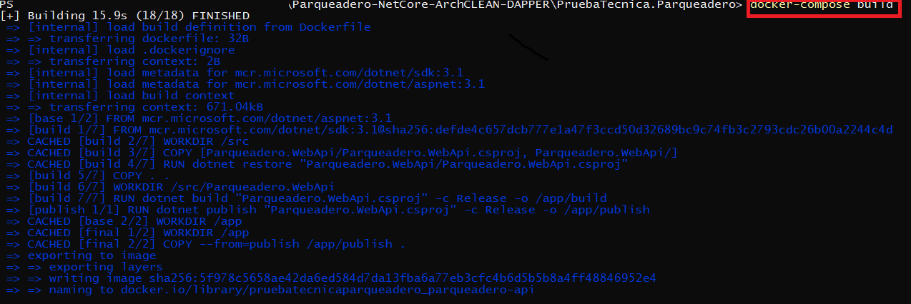

3. desplegar contenedores

```
docker-compose up -d
docker-compose ps
```
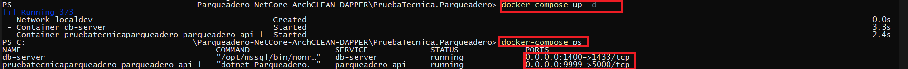

4. Contectarse a la base de datos `localhost,1400` con usuario `SA` y password `Pru3baTecnica!!!` resetear base de datos con script ubicado en `Parqueadero-NetCore-ArchCLEAN-DAPPER\PruebaTecnica.Parqueadero\Database\ScriptDB.sql`, tener en cuenta que el contendor ya tiene definida la persistencia de datos entonces toda la data de la db quedara en `Parqueadero-NetCore-ArchCLEAN-DAPPER\PruebaTecnica.Parqueadero\Database\Data`, el repo viene con la base de datos guardada en persistencia, pero si ocurre algun error a nivel de conexion de base datos, es mejor resetearla antes de enviar cualquier peticion.

## Documentacion del api

Una vez desplegado los contenedores de docker (y en llegado caso de ser necesario, resetear la base de datos) ingresar a la documentacion del api generada con swagger `http://localhost:9999/swagger`

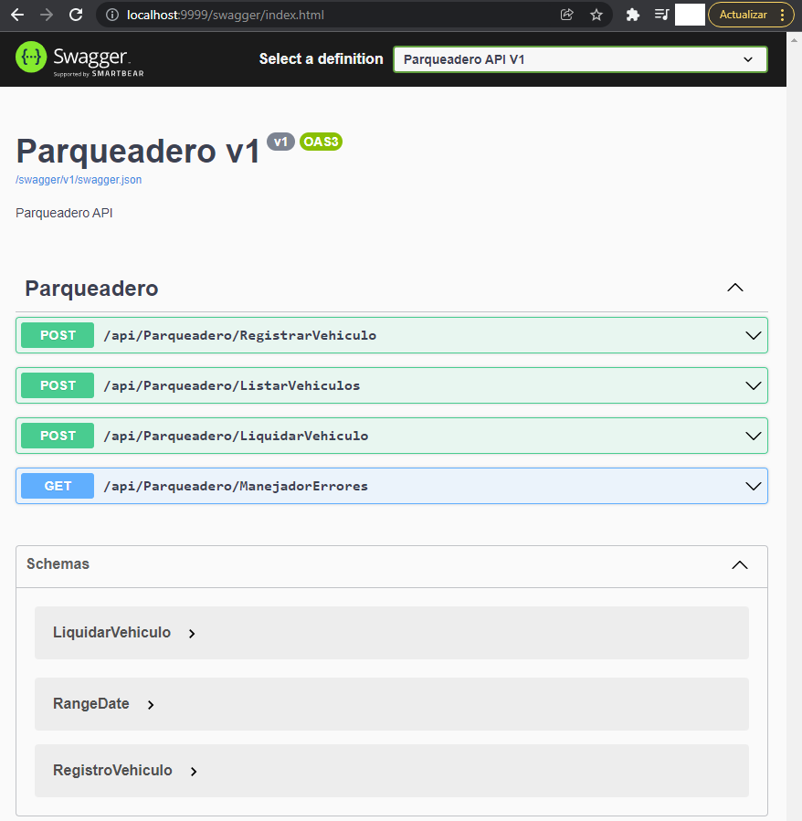

## Arquitectura usada

Resumen de la arquitectura usada (en los repositorios se uso dapper)

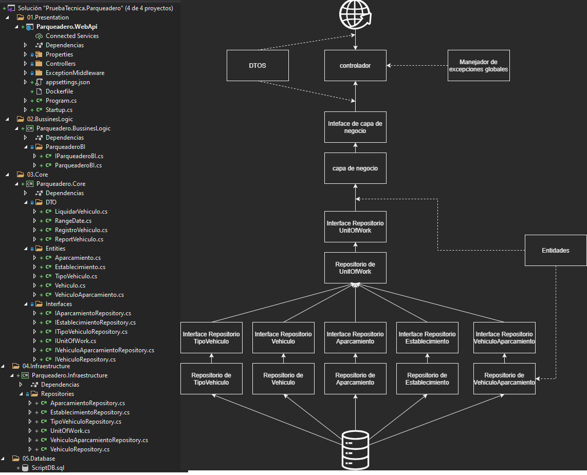

## Peticiones

Listar vehiculo en rango de fecha

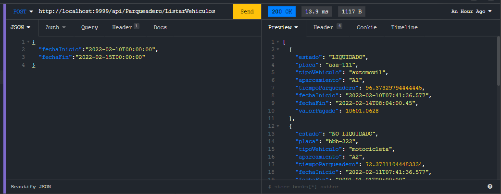

Registrar ingreso de vehiculo (si no existe lo crea, y realiza validaciones como : si ya ingreso y si corresponde el tipo de vehiculo en llagado caso que exista)

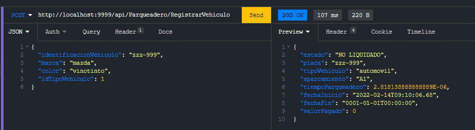

Liquidar salida del vehiculo sin factura (valida existencia del vehiculo dentro del parqueadero y existencia del establecimiento)

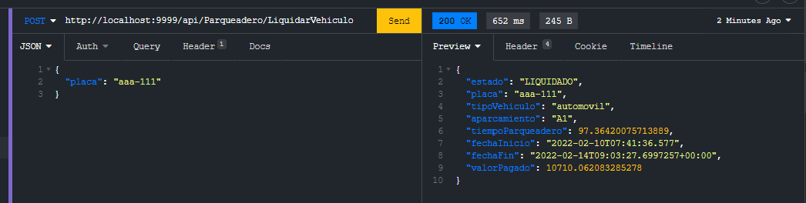

Liquidar salida del vehiculo con factura (valida existencia del vehiculo dentro del parqueadero y existencia del establecimiento)

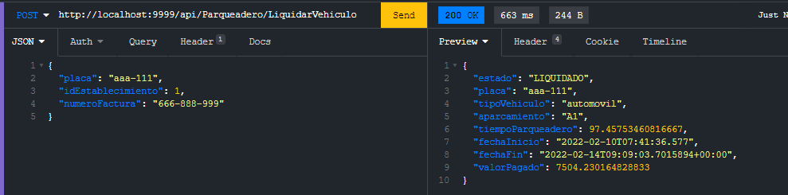

endpoint para validar el funcionamiento del manejador de las excepciones globales

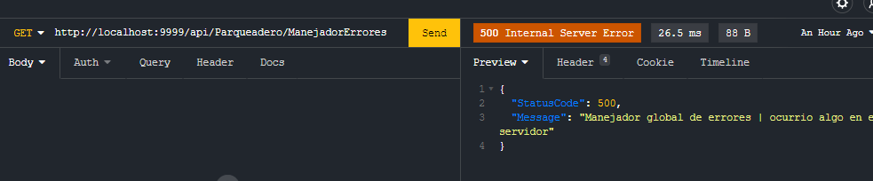


## Base de datos 

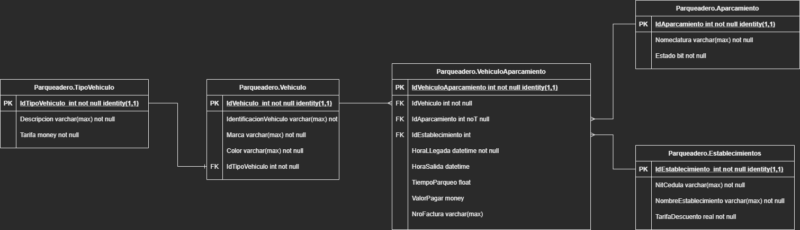

## Logs

se implemento con serilog un log especifo para cada una de las capas, se puede usar con injeccion de dependencias sobre la capa especifica.


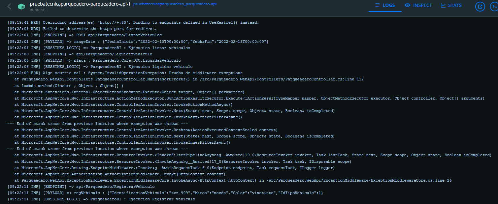